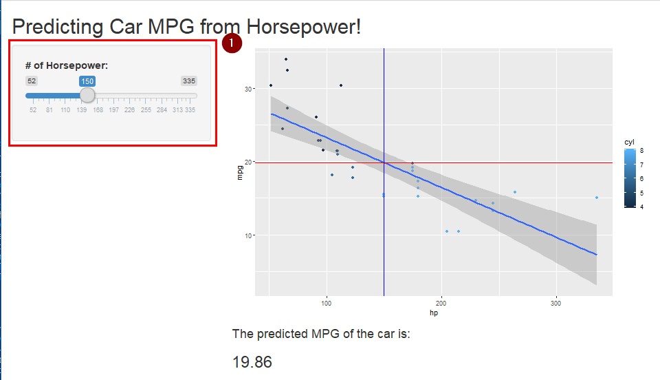
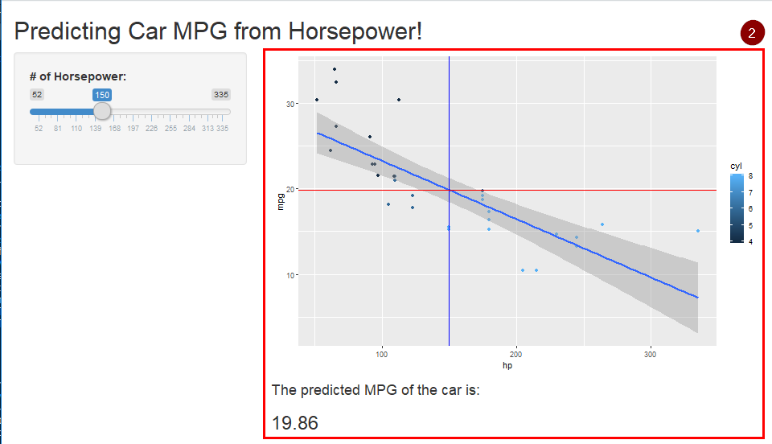

Car MPG Predictor from Horsepower
========================================================
author: Aldreen Venzon  
date: 1.10.2019
autosize: true

Overview
========================================================
This is a presentation on the Car MPG Predictor using Horsepower. 

The following slides will cover:
- Files used
- Dataset used
- How to use the app
- Results to expect


Files
========================================================
- The application is built using Shiny app containing a 'ui.R' and 'server.R' files. 
- This presentation is in the 'CarApp.Rpres' file. 


Dataset
========================================================
The dataset used is from 'MTCars'. The dataset sample looks like:

```
                   mpg cyl disp  hp drat    wt  qsec vs am gear carb
Mazda RX4         21.0   6  160 110 3.90 2.620 16.46  0  1    4    4
Mazda RX4 Wag     21.0   6  160 110 3.90 2.875 17.02  0  1    4    4
Datsun 710        22.8   4  108  93 3.85 2.320 18.61  1  1    4    1
Hornet 4 Drive    21.4   6  258 110 3.08 3.215 19.44  1  0    3    1
Hornet Sportabout 18.7   8  360 175 3.15 3.440 17.02  0  0    3    2
```
This application specifically uses the 'mpg' and the 'hp' columns


How to use the App
========================================================
- First, the user inputs the horsepower from a slider bar




Results
========================================================
- The application then uses a linear regression model to predict the MPG from the input
- It will output both a graph and text of the prediction


